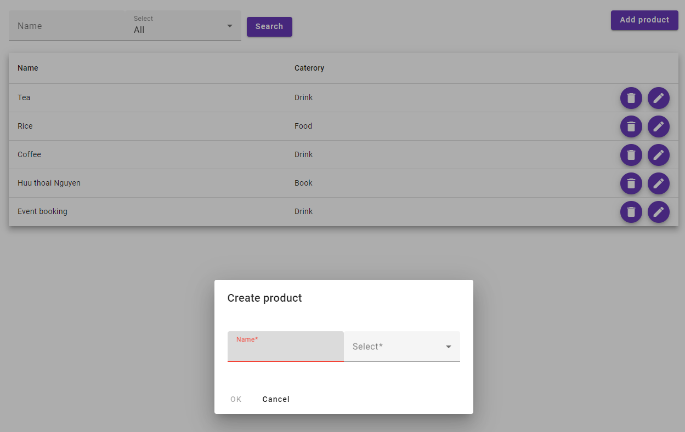

# Introduction

A product management web app implemented by Angular including CRUD operators based on REST API to manage product data of two companies (id = 1 and 2). This project aims to demo
how to interact with backend APIs using RxJS in Angular.

## Tech stack
Angular 17, TypeScript, Nx, RxJS, Angular Material UI


## How to get started?
```shell
npm install
npx nx serve
```

We can access product management screen via http://localhost:4200/company/1/products
